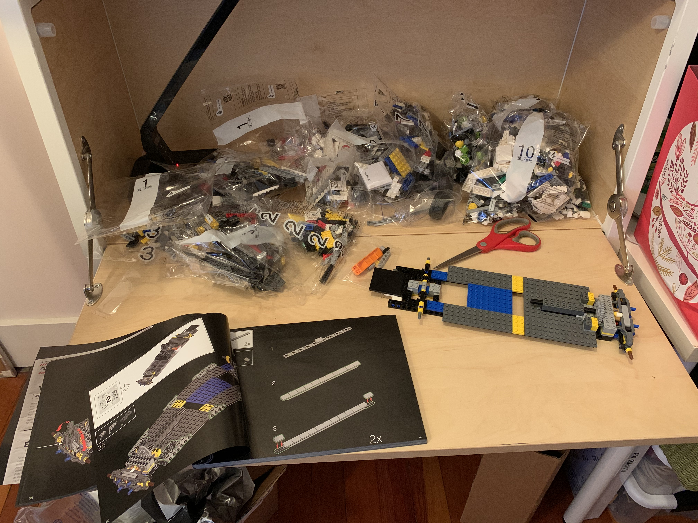

### 100 days of AI

At the end of 2025, I took a break from trying to stay current with all the changes in AI. I had a good year in terms of learning and projects...

* I built a platform to write a long form book
* I created a new architecture called Agentic Coupling that separates routing from execution for AI agents
* I update my implicit bias classifier to use ModernBERT
* I start training a model for NLU of book author instructions

I start 2026 craving knowledge and learning. Here I go again, another 100 days of doing something I really enjoy. I've done this before.
In 2021, I learned a hodge podge of things and also built a lego model of ECTO-1. I completed 54 days of work in 2023 and even built my first python library.
My goals for this next 100 days are simple. Get back on the wave and make sure I am up to speed on the latest in AI.  Topics include:

* AI UX
* AI trends
* Production deployment
* AI evaluation
* Responsible AI
* AI forward development
* Best of breed tools

Here we go!

## day 1 - Jan 1, 2026

I spent most of the day collecting the AI blogs I plan to follow. Here's the list so far:
https://huyenchip.com/blog/
https://eugeneyan.com/writing/
https://www.philschmid.de/
https://jxnl.co/writing/
https://huggingface.co/blog/
https://deepmind.google/blog/
https://openai.com/news/research/
https://www.anthropic.com/research
https://cohere.com/blog?tag=research
https://cursor.com/blog

Some things you may learn from looking at these blogs:

* Don't jump immediately to LLM as a judge - Chip Huyen
* Interesting methods for evaluating long context in Q&A, which is coming fast - Eugene Yan
* Vibe coding may mature into engineering in 2026, something I completely agree with - Philipp Schmidt
* Stop waiting for your AI model to save you - Jason Liu
* GuardRail may help generative AI with toxicity, misinformation and other generative issues - HuggingFace
* I need to spend some time with Gemini 3 - Google DeepMind

I have so much I need to read right now...

Linked my github repo to [codesandbox.io](https://codesandbox.io) and started two projects.  Second project was a react app where I installed styled-components to observe the package life cycle and understand the IDE better.  

## day 2

It's time for my next programming assignment from [Coursera Machine Learning](https://www.coursera.org/learn/machine-learning).  "Now you will implement the cost function and gradient for the neural network".  I completed the cost function today and will tackle the gradient next.  There is a HUGE difference in learning between auditing the course versus doing all the programing exercises.  The course is taught by [Andrew Ng](https://www.andrewng.org/), who is an Adjunct Professor from Stanford.  I highly recommend this course and Professor Ng.  I am also doing all my assignments in MATLAB using [MathWorks](https://www.mathworks.com/), which is another interesting online development environment.

## day 3

"Now, you will implement the backpropagation algorithm."  Assignment complete for backpropagation and gradient checking.  Time for egg nog...

## day 4

Happy Holidays to everyone around the world!  We exchanged gifts this morning.  What I received pretty much changed my agenda for day.  Not sure this qualifies as learning but it is some serious fun. Who you gonna call? Legos&reg; [Ghostbusters™ ECTO-1](https://www.lego.com/en-us/product/ghostbusters-ecto-1-10274)

 

## day 5

Jumped back into https://codesandbox.io to play with the useReducer hook in React.  This hook is a convenient way to introduce a local reducer within a component.  It's recommended as, "preferable to useState when you have complex state logic that involves multiple sub-values". [See the docs here](https://reactjs.org/docs/hooks-reference.html#usereducer).  useReducer seems very helpful, but I am not sure I would use it if I already had redux in place.  Then again, I have many examples of useState and redux in use in the same components, so why not?

## day 6

Completed a programming exercise for [Coursera Machine Learning](https://www.coursera.org/learn/machine-learning) studying models with different bias and variance properties.  Very interesting developing intuitions for what might be wrong with various models.

## day 7 

Starting a new simple-react app on my desktop using Visual Studio.  I know many people use a pre-packaged framework as a starting point, but I prefer to take an existing app and hack out all the existing features and data.  That's the main reason I am using react 16 here.  I'll be using simple-react to explore topics like accessibility and performance.  Today is more about house keeping to get a base app running.
