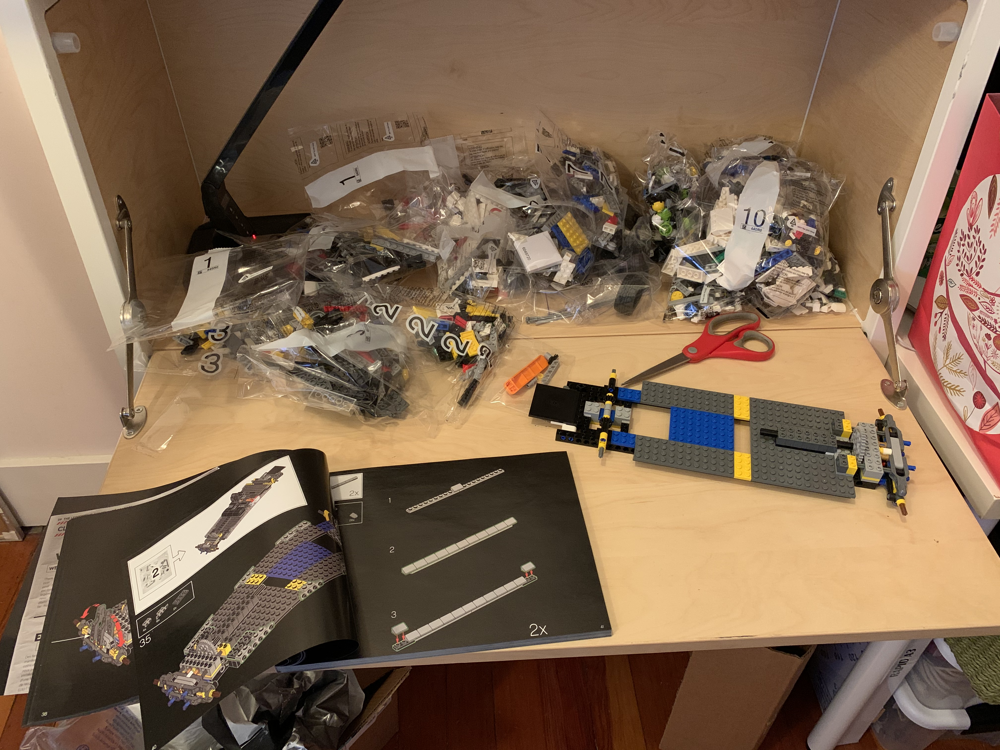
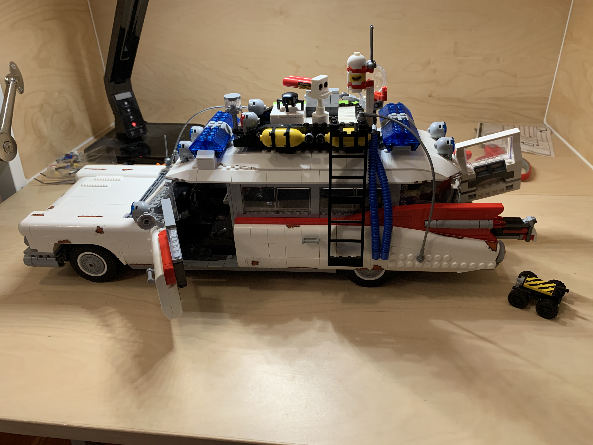
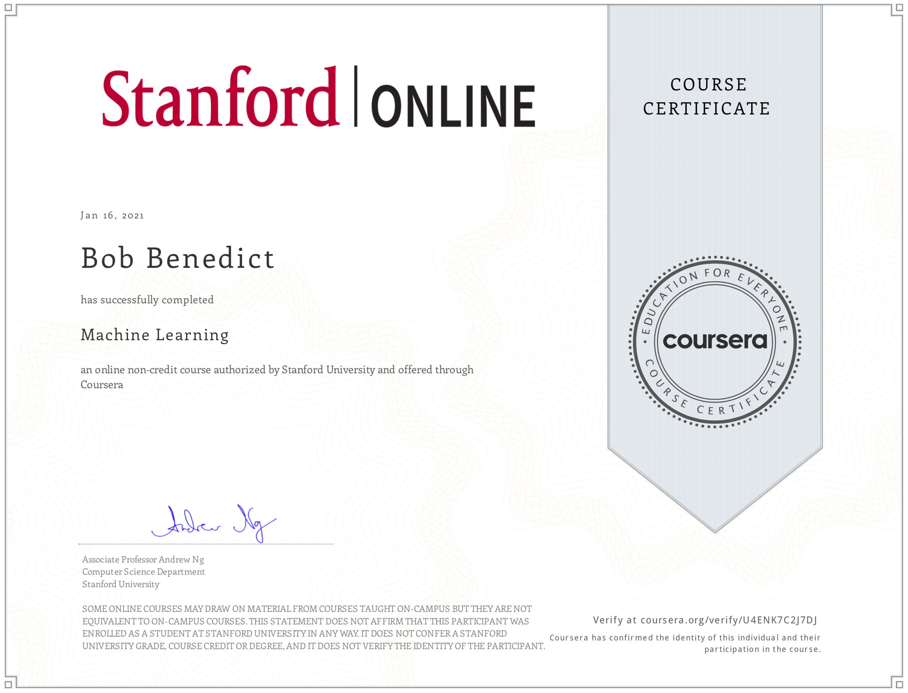

### 100 days of ~~coding~~ learning

I'm doing something along the lines of the 100 days of coding project. 
Instead of coding a single project, I hope to explore different areas
like development enviroments, technologies and languages.  So maybe I
should call it 100 days of learning something technical.

These are my areas of focus

* ML/AI
  * Coursera ML/AI courses
  * O'Reilly Python Machine Learning books
* React/UI/UX
  * D3js
  * React 16 exploration of hooks, performance, accessibility and other areas
* Full stack 
  * React/Express/Node/Mongo (otherwise known as the project that will never be done)
  * React + GraphQL 
* And now for something completely different (expect to see these around day 80 or so)
  * Smalltalk best practices
  * A console in Rust
  * Clojure or Elm or Haskell or ...
  
## day 1

Linked my github repo to [codesandbox.io](https://codesandbox.io) and started two projects.  Second project was a react app where I installed styled-components to observe the package life cycle and understand the IDE better.  

## day 2

It's time for my next programmng assignment from [Coursera Machine Learning](https://www.coursera.org/learn/machine-learning).  "Now you will implement the cost function and gradient for the neural network".  I completed the cost function today and will tackle the gradient next.  There is a HUGE difference in learning between auditing the course versus doing all the programing exercises.  The course is taught by [Andrew Ng](https://www.andrewng.org/), who is an Adjunct Professor from Stanford.  I highly recommend this course and Professor Ng.  I am also doing all my assignments in MATLAB using [MathWorks](https://www.mathworks.com/), which is another interesting online development environment.

## day 3

"Now, you will implement the backpropagation algorithm."  Assignment complete for backpropagation and gradient checking.  Time for egg nog...

## day 4

Happy Holidays to everyone around the world!  We exchanged gifts this morning.  What I received pretty much changed my agenda for day.  Not sure this qualifies as learning but it is some serious fun. Who you gonna call? Legos&reg; [Ghostbusters™ ECTO-1](https://www.lego.com/en-us/product/ghostbusters-ecto-1-10274)

 

## day 5

Jumped back into https://codesandbox.io to play with the useReducer hook in React.  This hook is a convenient way to introduce a local reducer within a component.  It's recommended as, "preferable to useState when you have complex state logic that involves multiple sub-values". [See the docs here](https://reactjs.org/docs/hooks-reference.html#usereducer).  useReducer seems very helpful, but I am not sure I would use it if I already had redux in place.  Then again, I have many examples of useState and redux in use in the same components, so why not?

## day 6

Completed a programming exercise for [Coursera Machine Learning](https://www.coursera.org/learn/machine-learning) studying models with different bias and variance properties.  Very interesting developing intuitions for what might be wrong with various models.

## day 7 

Starting a new simple-react app on my desktop using Visual Studio.  I know many people use a pre-packaged framework as a starting point, but I prefer to take an existing app and hack out all the existing features and data.  That's the main reason I am using react 16 here.  I'll be using simple-react to explore topics like accessibility and performance.  Today is more about house keeping to get a base app running.

## day 8 

Added redux to simple-react app.  Just about ready to start accessibility testing.

## day 9

First round of accessibility changes on simple-react app.  These changes were driven by the Lighthouse report in Chrome available in the devtools.  Simple changes including better contrast for colors, using alt text for all images and labels on all input fields.

## day 10

Resuming Coursera Machine Learning to stay on track with the course schedule.  I did some work with Support Vector Machines (SVM) using them with Gaussian kernals.  I then completed a few spam classification problems designed to be used with SVM.  4 more weeks of classes to go!

## day 11

Explored useContext with React today.  Yet another way to pass data between components in the component tree.

## day 12

Made good progress on the Coursera Machine Learning course over the holidays.  I am actually a little ahead of schedule right now.  The coding work today covered two areas.  I implemented parts of the K-means Clustering algorithm. I then used Principal Component Analysis(PCA) to perform dimensionalty reduction.  And finally, I topped the day off by completing my Legos&reg; [Ghostbusters™ ECTO-1](https://www.lego.com/en-us/product/ghostbusters-ecto-1-10274) project.

## day 13

Some experiments with useMemo in React.  The code is working, but I am pretty sure I am not taking full advantage of the useMemo hook and it's ability to return a memoized value.  Will revisit at a later date, hopefully with a better use case.

## day 14

Accessibility improvements for the simple-react app.  Adding regional tags such as header and nav to improve the screen reading experience.  I am using VoiceOver on Mac to validate changes.  This is a VERY eye opening experience.  You are trying to navigate from say a Chrome browser tab to your application, and every key you press causes an audio snippet to begin playing.  I really wanted to take my headphones off while learning as a result, but that defeats the purpose of this learning.

## day 15

Created a custom hook in the codesandbox-react app.  I also came up with a better example for useMemo that works more as expected.

## day 16

Added eslint and a11y rules to the simple-react app.  Put in the obvious rules first like alt text and links with href.  I'll add more to the rules as I add more support for accessibility in this app.

## day 17

I coded a more complex scenario for accessibility adding support for a chart.  Think of this as a complex image that requires a secondary or contextual explanation.  The W3C provides an excellent [tutorial for handling complex images](https://www.w3.org/WAI/tutorials/images/complex/). My ability to navigate with VoiceOver is improving, though I still have a long way to go to feel comfortable relying on voice only for interacting with websites.  A very educational experience.

## day 18

Supporting font size scaling for the visually impaired in simple-react app.

## day 19

Working on my last programming assignments for Coursera Machine Learning.  After this, I just have a two weeks of lectures to complete to finish the course.  Today I am working on Anomaly Detection.  The task is to estimate the parameters &mu; and &sigma;2 for a Guassian distribution of a matrix of features.

## day 20

I implemented parts of a Collaborative Filtering system for recommendations.  The specific work was to produce a vectorized implementation for calcualting the gradient of a cost function given a matrix of users x features and movies x features.  As of today, I have completed all programming assignments for Coursera Machine Learning.  QED!  

## day 21

Time to open up a new thread for learning.  I'm starting the O-Reilly book Introduction to Machine Learning with Python.  We'll see how much the Coursera ML course helps with better understanding what's happening behind the scenes of some of these libraries.  First day of learning is all about spinning up the IDE, in this case Jupyter Notebooks.  Got stuck in pip install hell for a while.  Installs unrelated to this project pushed me to python 3.8 (thanks a lot AWS CLI) and it took me a while to get the right scikit-learn, numpy, pandas versions for my version of Python and Mac OSX.  Trained a simple model today so hopefully those issues are behind me.

## day 22

Finished the linear regression models from the O-Reilly book.  Trying to create Jupyter notebooks that might act as a real time reference in the future.

## day 23

First attempt at k-means clustering.  Working example but needs some clean up.

## day 24

Cleaned up...

## day 25

Worked with some more examples from the O-Reilly book Introduction to Machine Learning with Python.  I also decided to set up a notebook page dedicated to plots and graphs to consolidate specific examples with unique attributes or methods for creating the images.

## day 26

No coding today but I am pretty sure this counts as learning.  

## day 27

Spent some time testing more features of CodeSandbox.  I wanted to explore the full developmnt life cycle a bit more by adding automated tests to my test app.  They use Jest, which worked fine for my purposes.  

## day 28

Started work on Suport Vector Machines in the python O-Reilly repo.  Just have the basics working for now.

## day 29

More accessibility changes in simple-react app using the html attributes role, aria-label, h1 header properly.  I think I am pretty close to have a strategy to improve accessibility in our application.  Next step is to schedule a "brown bag" discussion.

## day 30

Had to segue into elasticsearch land for today's entry.  Fixed some issues with our scripts that reload search indexes.  

## day 31

... and then I had to do some mysql work to fix some anomolies in our database.  

## day 32

Although this is not listed in my initial list, I've wanted to explore git-flow more in depth especially the use of release branches.  I've primarily used feature branches merged into develop and then main for my team projects, along with hotfix branches as needed.  I used a temp repo and created various "feature branches" to see how it all works. 

## day 33

Started work on Neural Networks from the ML/python O-Reilly book.  Today was mostly reviewing the parameters from the scikit libraries https://scikit-learn.org/stable/modules/generated/sklearn.neural_network.MLPClassifier.html

## day 34

Added the examples from O-Reilly including a new graph in the graphs and plots collection.

## day 35

Created a model parameter tester for scikit nueral network classifier.  The tester iterates through the different solvers, confgiruations for hidden layers, and other parameters to see what combination gets the best result on the test set.  Included also the worst result for ceiling analysis.  This should come in handy when I try other neural network libraris on the various datasets.

## day 36

Another seque data looking at an non-open source data set extracted from a MySQL database.  If you look what I did tomorrow, you'll see one of the changes I need to make to the data set for creating better models.

## day 37

More Python O-Reilly book examples this time exploring categorical data.  I also added some techniques to clean up the data that I learned in a basic Udacity class some time ago.  This work will come in handy when I resume working on my non-open source data set.

## day 38

Resumed work on the non-open source data set.  Converted the project to jupyter a notebook.

## day 39

Significant work on the non-open source data set.  Generating charts on answers provided by users.

## day 40

Now using dataframes to create graphs from questions that have the most responses from an account list.  This is going to come in very handy for deciding which questions are interesting to look at.

## day 41

I'm starting a new report today: simple-node-graphql.  Could this be the challenege to REST that everyone is saying it is?  We shall see.  Seems like a simpler way to implement a server API by having a single endpoint and specfiying the data you need at time of request.  
