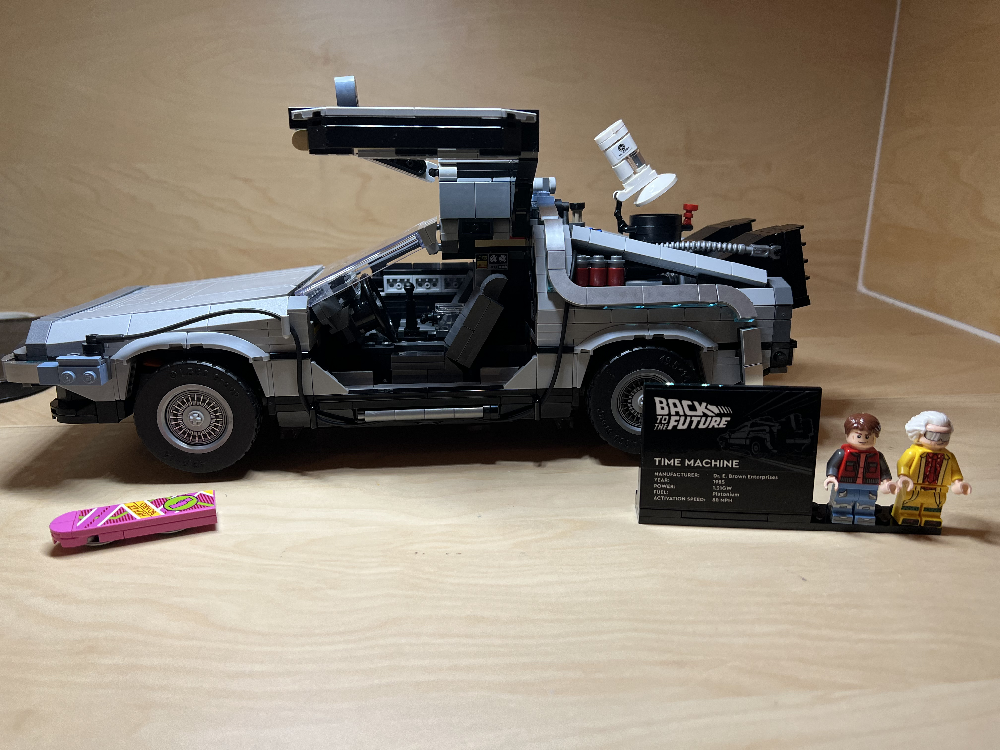

### 100 days of coding

We're coming to the end of 2023 and my brain is telling me I haven't tried to learn enough this year.  This usually happens around Nov.  By Dec, I am working on something in anticipation of the inevitable New Year's resolution.

I decided to do a 100 days of coding challenge inspired by a small test project from a few months ago. I was exploring all the different ways you use prompts with LLMs and ended up creating a unified completion function that handles system prompts, context, streaming, everything.  Here's sample code showing ```get_completion```.  The undescore is the content which can be used when not streaming the response.

```
_, messages = get_completion(client,
                             content_callback,
                             user_prompt="Who won the first world series?",
                             system_prompt="Explain this like a child is talking to an adult",
                             stream_response=True
                             )

_, messages = get_completion(client,
                             content_callback,
                             user_prompt="Who was the most valuable player?",
                             messages=messages)

_, messages = get_completion(client,
                             content_callback,
                             user_prompt="Who was the most recent MVP of this?",
                             messages=messages)

```

I began thinking how I might use the code in other ways. What could you do if you took the output from one completion and passed it to another?  And from there, I wondered what I could do with this project?  Most importantly, what could I learn from this work? I realized that I never really started an open source project before.  That sounds interesting!  All this thinking led me to **completion paths**.  A completion path allows you to link together several completions or outcomes generated by third party APIs by passing the results from one step in the path to the next.  

Here's what I am hoping to learn:

* Best practices for open source projects
  * A good way to set up the org, the project, the repo
  * What does a good project look like
  * How do you manage issues or promote your work
* What tools work best for python package creation
  * When should you deploy a new package
  * How does the CI/CD pipeline factor in
  * What standards like PEP 8 do people follow
* How do you validate a package where a significant portion of the app uses third party APIs
  * How do you create automated tests without driving up costs
  * How do you track if the third party API has changed
* A deep dive into the fork and pull request process for contributing
  * Likely to use an existing project for this part
  * What does it take to get a feature included in the main branch


Two disclosures before I start.  First, I started this a few days ago.  The first 7 days of this project are 
in the rear view mirror.  Second, my day job is VP, Engineering for Capacity.  A company using AI to help 
support teams do their best work.  The job can get pretty demanding and some days I won't have time for this 
learning experience.  Long story short, the days are not going to be sequential.  But I will hit 100 days at 
some point!

Here we go.  100 days of coding starts now (or did 7 days ago).
  
## day 1

I reviewed the code of the unified completion function and began to map out my plan.  I decided I would need
paths that connect steps, and each step would need a config to speak with the LLM.  Made a copy of the project
and started re-factoring.

## day 2

First successful execution of the code.  I created a path with two configs, both using OpenAI GPT-4 for completion.
I must admint I created some pretty funny conversations.  One of them I will definitely blog about.  If nothing else,
this package will be a great way to create a dialog between two AI personalities.

## day 3

Looked at some other successful open source projects to see how they were structured.  Also looked at what tools 
they used.  I decided to go with poetry for package management and building.  Was able to do my first build.

## day 4

Spent way too much time organizing things into folders.  Isn't that always the case?  I took some of the sample 
output from day 2 and moved it to a new project.  Have to admit I was inspried by the aforementioned hilarious 
conversation.  The new project will be my test reference implementation of the new package.

## day 5

I spent most of the time today working with poetry.  I was trying to figure out the development cycle for building
a new package.  The tricky part is how you get the reference project to update the package after changes.  Once live,
this is done by changing the package version number.  In the end, poetry didn't work how I needed.  The reference
project is back on pipenv and I created a shell script to remove the library, clear the cache, and re-install.

## day 6

Tests, tests and more tests.  I created a mock adapter to simulate calling a third party API.  I now have basic
unit tests for paths and steps, along with one scenario test.  Hopefully, this will help speed up development.

## day 7

Today I refactored the app to use data classes.

## day 8

Added support for cohere generate.  cohere doesn't seems to support context the way openai does so will need
to create a context data structure such that each adapter can map that to the correct data structure.
I new this was coming as soon as I added a second integration.

## day 9

Context class created.  Now used with openai adapter.  Each adapter will need to convert the general Context
class into the specific needs of the API.

Added a way to validate a third party API, which was needed to validate the context changes.  Later we can
automate this to provide a general status on third party API's up-time/status or to monitor if important parts 
of the API have changed.

## day 10

Re-factored adapters to use the context class.

## day 11

Added the common parameters to each adapter (i.e temperature, max_tokens).  If Martin Fowler, author of
*Refactoring: Improving the Design of Existing Code*, saw this work, he'd tell me to re-factor the
handling of these common paramaters into a single function or class.

## day 12

I listened to Martin.  Introduced a base adapter class that handles all common paramaters.  This led
to a furher refinement of the config object.  I suspect some day the config will also become a dataclass.

## day 13

Went deep on type hints today.  Very interesting, although I am a little concerned I am just adding overhead
to the project.  Created shell scripts to run type checking and lint, will eventually add to github actions.

## day 14

Started organizing example paths into folders.  Example paths also help with testing.  

## day 15

Modified the mock adapter to simulate temperature and max_tokens.  This helps test the BaseAdapter class.

## day 16

Added user prompts to the step config.  This enables dialogs.  By default, the output of one step is the 
input to the next step.  But sometimes you want the output of one step to be the context instead.  I'll
need to create an example to explain this in the docs for sure.

Just like my 2021 100 days of learning experiment, I was distracted for a few days by a Christmas present!
<div>

</div>

## day 17

DeLorean finished.  Back to work.  Added support for HuggingFace external API today. I plan to also support
downloaded or local models.

## day 18

First version of hugging face local models.  Need to add paramater support.  
Also created a generalized prompt creation function that considers context in the base adapter.

## day 19

Finished hugging face local support. Created paramater mapping for cases where parameter names don't match exactly.
between providers or models. Many models use max_tokens but hugging face uses max_length or max_new_tokens.

## day 20

Input data added to existing adapters.  First version of it anyways.  Still need output data, tests and 
re-factor.  But it works pretty well!

## day 21

Initial logger.  Using a singleton pattern. Will pepper logging over the code as I go.

## day 22

Re-implement singleton pattern of the logger as the first attempt didn't quite work as expected.  All good now.

## day 23

Re-factor steps to support step_type (partially).  Pre-cursor to introducing metric steps and other types of steps.

## day 24

Completed re-factor. Minor cleanup to create src folder for primary classes.

## day 25

Starting on metrics with a bias metric.  Today was mostly researching and prototyping.  Finding the right solution
will be harder on this one than writing the code to implement.

## day 26

Metric steps implemented.  Still need to add unit tests.  Still concerns over the model.

## day 27

Add tests to metrics including a mock metric. Renamed a few of the major exports.  We now have CompletionPath
CompletionModel, CompletionMetric and CompletionResponse.

## day 28

First attempt at completion templates using "act as if" for first template.

## day 29

Lot's of re-factoring to better support prompt templates.  More work to go.  

I wanted to capture a big side track on bias in AI.  I have a bias metric in this project using one of the most downloaded 
models from Hugging Face.  As I noted on day 26, I have concerns over the effectiveness of the model.  I've tried a couple 
now. Some are good at the more well known AI bias issues like gender and race.  But most can not handle other types of
bias such as age or economic bias.  I spent a fair amount of time examining models and different types of bias.  
Learned a lot!!  Just didn't advance this project much during that time.

## day 30 

Added task and steps prompt template.  This is also called Instructions + Questions and other things.  Need to add better
test for the different prompt templates.

## day 31

Sentiment analysis metric

## day 32

Chain of thought and examples templates.

## day 33

Accuracy metric using semantic simularity.  Works pretty well but the user must provide reference content.

## day 35

Added rouge scores.  Pretty straight forward after adding accuracy.

## day 36

Worked more on bias.  Now have a working example of combining two models using arithmatic mean.

## day 37

Knocking down some tech debt.  I track these in code using TODO: comments.  Highly recommend this approach.

## day 38

Lot's of unit tests for metrics and templates.


